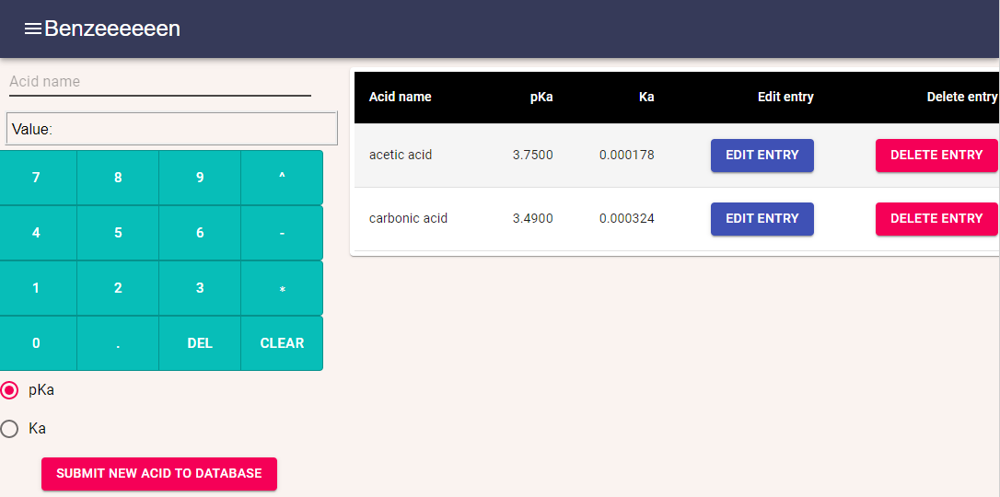
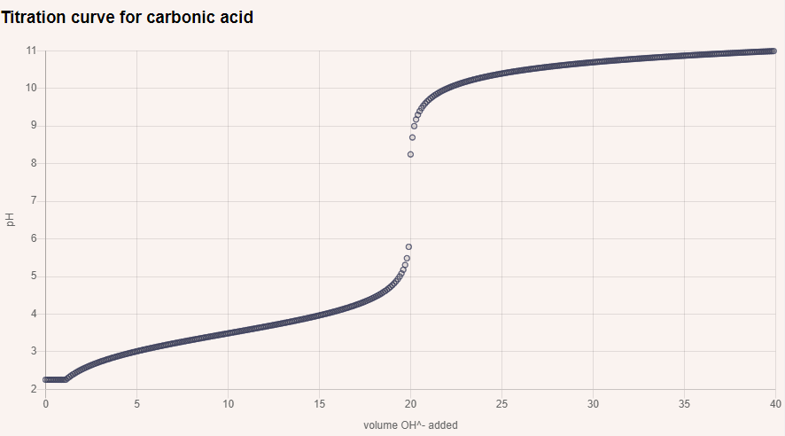

# benzeeeeeen

# Table of contents
1. [Description](#Description)
2. [Installation instructions](#Installation-instructions)
3. [Contributions](#Contributions)
4. [License](#License)
5. [Questions](#Questions)

## Description: 
This is an in-progress application for chemistry teachers, by chemistry teachers. As of right now it builds a database of weak acids and can use that database to generate theoretical titration curve data for weak acid/strong base titrations. More and more functionality will be added to benzeeeeeen to make this a one stop shop for chemsitry teachers looking to save time. 

Users can add, remove, and edit acids in the database:

Users then enter experiment conditions and use this to generate titration curve data:

## Installation instructions: 
Users should npm install before running the program.

## Contributions: 
This us currently a solo project of skolnikskolnik

## License:  
This project is covered under the MIT License license.

## Questions
Visit my <a href='https://www.github.com/skolnikskolnik'>github page.</a> 

Email me at jtskolnik@gmail.com with any additional questions you may have. I am always happy to talk to users of my product!
    